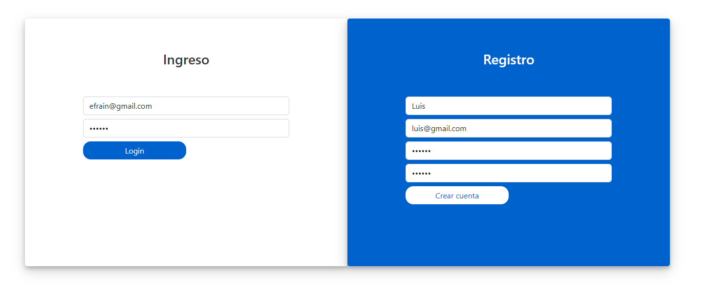
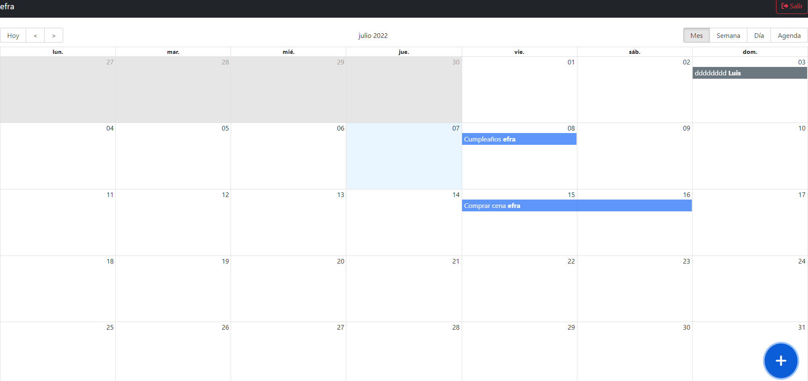
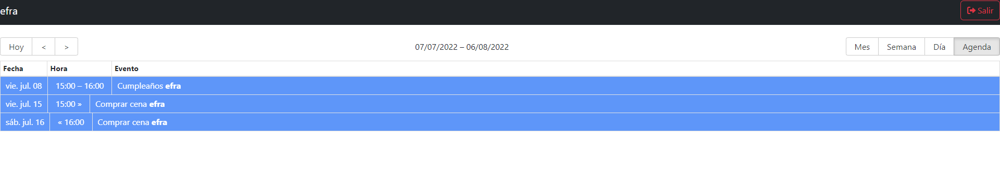

# Calendario con React en Heroku y MongoDB
En esta aplicación se busco emular como seria el desarrollo de un calendario con varios usuarios, con un sistema de login de protección de rutas, todo esto subido a un servicio en la nube como Heroku y un sistema de base de datos con MongoDB como servicio en linea, emulando lo mas realista a un caso en particular, se utilizaron las siguientes tecnologías:

- HTML
- CSS
- JavaScript
- React
- Redux
- MongoDB
- Heroku

## Capturas de la aplicación

> Login y Register

> Dashboard

> to day

